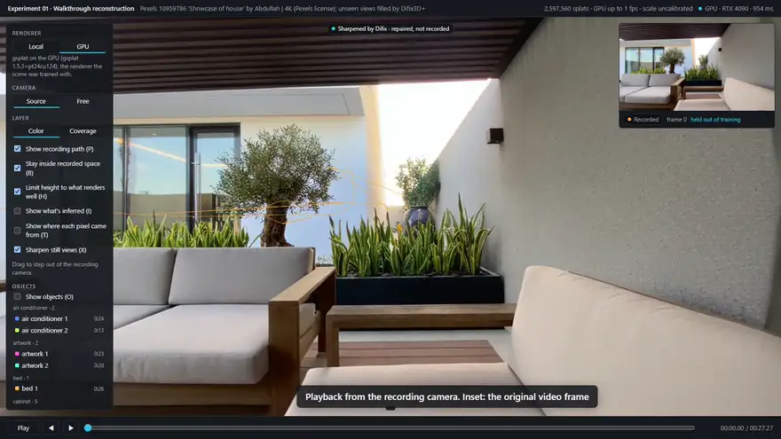
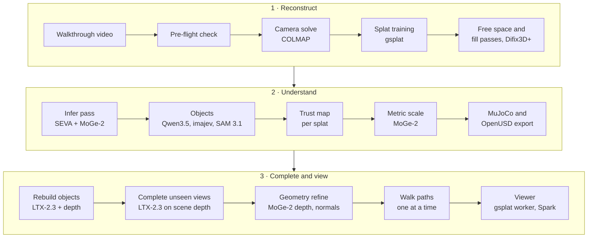

# Braindance Studio

Turn one walkthrough video into a 3D place you can walk around in, and always know which parts are real.

Braindance Studio rebuilds a phone-style walkthrough video as a 3D Gaussian-splat scene you can explore in the browser. Every splat is labelled by where it came from: recorded, inferred, rebuilt or completed. Its objects are identified, can be moved or removed, and export to MuJoCo and OpenUSD in metres. Where the camera never looked, a video model (LTX-2.3), steered by the scene's own depth, draws the missing views, and they are fitted back into the scene without touching anything that was recorded.

[](docs/media/demo.mp4)

**[Watch the full demo (65 s, MP4)](docs/media/demo.mp4)**. The preview above runs at 2.5× speed. It's a real recording of the viewer in GPU mode on an RTX 4090, in the courtyard scene built from [Pexels 10959786](https://www.pexels.com/video/10959786/) ("Showcase of house" by Abdullah):
1. Playback from the recording camera.
2. Stepping out and walking past the sofa, into space the video never saw.
3. The trust view.
4. Selecting the sofa, pushing it away, removing it and putting it back.
5. A still view sharpened by Difix.

## What it does

| | |
|---|---|
| **Reconstruct** | Camera solve (COLMAP, with ALIKED + LightGlue when SIFT breaks), then splat training (gsplat). A pre-flight check rejects footage that won't work before hours of compute. |
| **Label every pixel** | A trust map from each splat's blending weight in the recorded frames. The viewer's trust view (T) colours each pixel by where it came from, with the share of the screen each class covers. |
| **Find the objects** | Qwen3.5-4B lists what's there, [imajev-4b](https://github.com/mohit67890/imajev) confirms each kind with calibrated probabilities, SAM 3.1 tracks it through the video, and the tracks are placed on the splats. For the courtyard: 87 objects of 33 kinds, each with material, movability and mass. |
| **Fill what was never seen** | Four generative passes, each fitted only where the recording didn't look: Difix3D+ repairs, Stable Virtual Camera infers, LTX-2.3 rebuilds whole objects, and LTX-2.3 completes camera paths (turns and walks), guided by the scene's own depth. Recorded splats are frozen throughout. |
| **Keep surfaces solid** | MoGe-2 depth and normals keep generated surfaces from turning to glass, and a free-space check drops generated splats that a recorded camera saw straight through. |
| **Edit** | Select an object, then push, pull, slide, turn or remove it, or put it back. Then **film the move**: LTX-2.3 makes it happen in the real recording, steered by point tracks worked out in 3D (V2, below). |
| **Real to sim** | MuJoCo (MJCF) and OpenUSD (UsdPhysics) export in metres (MoGe-2 metric depth), with concave colliders from the splats and per-object mass, friction and movability. |
| **View** | A browser viewer. GPU mode streams frames from a local gsplat worker (the renderer the scene was trained with, about 55–60 fps at 1080p on a 4090); browser mode uses Spark and needs no GPU. Still views that are at least half recorded get a Difix repair, labelled "repaired, not recorded". |

## How it works



Every stage writes its own viewer package (`viewer/<scene>-<stage>/`), so you can open and compare any stage. Four ideas hold it together:

1. **Recorded is ground truth.** Each splat's blending weight in the recorded frames decides its trust class. Splats seen from several angles are frozen whenever generated content is fitted, so a video model can't overwrite what the camera saw.
2. **Generate along the scene's own geometry.** Camera paths are planned from recorded frames into the least-recorded directions. Along each path, LTX-2.3's union-control IC-LoRA is guided by the scene's rendered depth, starts from the recorded frame, and is pulled back to the scene's own render at keyframes. A caption from Qwen3.5-4B keeps it in the right kind of place.
3. **Teach only what was never seen.** A generated frame only trains the pixels no recorded frame covered. Generated pixels are lifted into new splats at MoGe-2 depth. Any new splat that a recorded camera saw straight through, to a surface behind it or to open sky, is dropped. Paths are completed one at a time, each guided by what the previous one left, and the run stops if held-out recorded views get worse.
4. **Say what you're showing.** The viewer labels the renderer, the trust class of each pixel, what's inferred, and whether a still view was repaired. Held-out recording frames score every stage.

**Courtyard results** (held-out recording frames, half resolution):
- **Score:** 28.9 dB PSNR, with 2.6M splats. Of those, 17% are recorded, 4% recorded once, 13% filled, 22% inferred, 2% rebuilt and 42% completed.
- **Compute:** about 5 hours on one RTX 4090, from video to the final scene.

The full research log, with every number, failure and fix, is in [`experiments/01-walkthrough-recon/README.md`](experiments/01-walkthrough-recon/README.md).

## New in V2 (in progress)

V2 adds [TAPNext++](https://github.com/google-deepmind/tapnet) point tracking, and uses it to steer and check generation:

- **Film a move.** Move or turn an object in the viewer and press **Film this move**. The background's tracks come from points triangulated in 3D and projected through the recorded cameras, so the camera moves exactly as it did. The object's tracks are its own surface points, moved the way you moved it. LTX-2.3's [motion-track IC-LoRA](https://huggingface.co/Lightricks/LTX-2.3-22b-IC-LoRA-Motion-Track-Control) regenerates the clip from the recorded first frame along those tracks. TAPNext++ then measures how well it followed them. Courtyard sofa, 0.6 m toward the camera and turned 15°: 6.6 minutes end to end; the sofa's points stayed within 6.6 px of their paths, and the camera within 6.4 px of the real one.
- **Measure the fog.** Tracks through the generated walk paths show where the completed parts sit in front of the real surfaces: 11–24% too near (median), which is the fog seen from off the recorded path. Re-fitting with those tracks (`scene_bake.py --tracks`) about halves that and sharpens completed areas by 11%, at 0.6 dB on recorded views. It looks only slightly better: most of the fog was drawn into the generated frames themselves.
- **Replace an object from a prompt.** Qwen-Image-Edit-2511 redraws the object in its best recorded frame (`object_edit.py`), and SAM 3 cuts it out. Placing a 3D object back in by its silhouette works (`object_place.py`). The step in between, image to 3D with TRELLIS.2, is built but waiting on access to Meta's DINOv3.

Setup for these is in [docs/INSTALL.md](docs/INSTALL.md#5-tracking-motion-edits-and-the-2d-replace-step-v2).

## Install

Windows 10/11 with an NVIDIA GPU (built on an RTX 4090 with 24 GB, 64 GB RAM). You need [git](https://git-scm.com) (which includes Git Bash), [uv](https://docs.astral.sh/uv/), and Visual Studio Build Tools with a CUDA 12 toolkit (to compile one package). macOS and Linux are untested.

In Git Bash, from the repo root:

```bash
./install.sh                      # core: reconstruct a walkthrough video and view it (~6 GB of models)
./install.sh --all                # + objects (SAM 3/3.1) and the infer pass, captions, attributes (SEVA, Qwen3.5, imajev)
./install.sh --comfyui D:/ComfyUI # + LTX-2.3 for that ComfyUI: object rebuilds, completing unseen views (43 GB)
./install.sh --check              # what's installed and working
```

What it does:
- **Before downloading:** it lists every download with its size and asks first.
- **Reuse:** it copies models already in your Hugging Face cache instead of downloading them again.
- **Safe to rerun:** finished steps are skipped, and an environment that already works is left alone.

Some models are gated (SAM 3, Stable Virtual Camera): accept their terms on Hugging Face and run `hf auth login` first. What each step does, and how to do it by hand, is in **[docs/INSTALL.md](docs/INSTALL.md)**.

## Quick start

View a scene you've built (two terminals, from the repo root):

```bash
.venv-recon/Scripts/python.exe experiments/01-walkthrough-recon/viewer/serve.py 8790
```

```bash
.venv-recon/Scripts/python.exe experiments/01-walkthrough-recon/gpu_render_server.py
```

Then open `http://localhost:8790/?scene=<scene>/`. The header shows "GPU · <your card>" when the worker is connected; without it, the viewer falls back to browser rendering.

Build a scene from your own video:

```bash
.venv-recon/Scripts/python.exe experiments/01-walkthrough-recon/import_walkthrough.py --name loft path/to/walkthrough.mp4 --wait-for-gpu
```

This runs the pre-flight check, camera solve, training, free space, fill passes, objects and (with `.venv-seva`) the infer pass, then prints the viewer link. It resumes where it stopped. The full chain that built the courtyard in the demo, including rebuilds, completion and walk paths, is in [docs/INSTALL.md](docs/INSTALL.md#the-full-courtyard-pipeline).

**Footage that works:** a still space (nothing moving), walking through it rather than standing and panning, sharp, well-lit frames (ideally 4K), and one lens with no zoom.

## Viewer controls

| Key | |
|---|---|
| Space, ← → | play or pause, step a frame |
| Drag | step out of the recording camera and look around |
| W A S D, Q E, Shift, wheel | move where you look, strafe, down and up, faster, forward and back |
| L | lock back to the recording camera |
| T | trust view: where each pixel came from, with live shares |
| O | show objects; click one to select it |
| Delete, `[` `]`, Esc | remove the selected object, turn it, deselect it (Away, Toward, Left, Right, Reset and **Film this move** are in the panel) |
| X | sharpen still views with Difix (on by default) |
| I | tint what the infer pass estimated |
| C | coverage layer: from how wide a range of angles each point was seen |
| B, H | stay inside recorded space; limit height to what renders well |
| P | show the recording path |
| G | switch between GPU and browser rendering |

## Limits (honest ones)

- **The scene is static.** Nothing moves; people in the footage leave ghosts, and the pre-flight check warns about them.
- **Completed views are soft.** Walking past the sofa and looking back shows a coherent garden, but it's softer than the recorded parts, and some spots stay murky, such as the end of a path pressed against planting.
- **Generation is offline.** Unseen areas are filled once and saved, not generated as you move. Live generation at the edge of what's known is the next step.
- **Moved objects leave a hole.** A moved or removed object shows what's behind it, which was often never recorded.
- **Filmed moves guess what the first frame doesn't show.** When the camera pans onto something outside the first frame, the video model invents it (a pool, an extra armchair). Large turns can also change the object's shape.
- **The physics export hasn't been stepped in a simulator yet.**

## Repo layout

```
VISION.md                          product north star
docs/INSTALL.md                    environments, tools, models, full pipeline
docs/media/                        demo video
experiments/01-walkthrough-recon/  every pipeline script, the viewer, and the research log (README.md)
  viewer/index.html, serve.py      the viewer and its dev server
  gpu_render_server.py             GPU render worker (gsplat + Difix)
tools/                             third-party code and models, fetched by setup (git-ignored)
```

## Credits

- **Footage:** [Pexels 10959786](https://www.pexels.com/video/10959786/) by Abdullah (courtyard), and clips by [Kindel Media](https://www.pexels.com/@kindelmedia) (kitchen, house), used under the [Pexels license](https://www.pexels.com/license/). Clips are downloaded, never committed.
- **Tools and models:**
  - Reconstruction and rendering: [gsplat](https://github.com/nerfstudio-project/gsplat), [COLMAP](https://github.com/colmap/colmap), [Spark](https://github.com/sparkjsdev/spark), [three.js](https://threejs.org).
  - Repair and depth: [Difix3D+](https://github.com/nv-tlabs/Difix3D), [MoGe-2](https://github.com/microsoft/MoGe).
  - Generation: [Stable Virtual Camera](https://github.com/Stability-AI/stable-virtual-camera), [LTX-2.3](https://huggingface.co/Lightricks/LTX-2.3-fp8) with the [union-control IC-LoRA](https://huggingface.co/Lightricks/LTX-2.3-22b-IC-LoRA-Union-Control), [ComfyUI](https://github.com/comfyanonymous/ComfyUI).
  - Objects: [SAM 3](https://github.com/facebookresearch/sam3), [Qwen3.5-4B](https://huggingface.co/Qwen/Qwen3.5-4B), [imajev](https://github.com/mohit67890/imajev).
  - V2: [TAPNext++](https://github.com/google-deepmind/tapnet) (tracking), the [LTX-2.3 motion-track IC-LoRA](https://huggingface.co/Lightricks/LTX-2.3-22b-IC-LoRA-Motion-Track-Control), [Qwen-Image-Edit-2511](https://huggingface.co/Qwen/Qwen-Image-Edit-2511), [TRELLIS.2](https://github.com/microsoft/TRELLIS.2).
- **Licences:** each project has its own terms, and several models (for example SEVA) are non-commercial. This project is a non-commercial research experiment.
